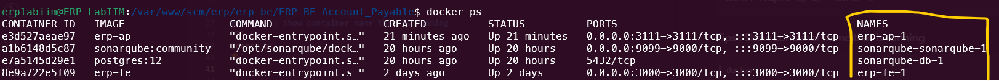

# Deploy Backend Service with docker (mysql in host)

### 1. Create dockerfile [file](./Dockerfile)

### 2. expose port the app running on ex 3111
```
EXPOSE 3111
```

### 3. Create configuration in docker compose
```yml
  ap:
     build:
       context: ./erp-be/ERP-BE-Account_Payable/ # path to dockerfile
       dockerfile: Dockerfile
     restart: always
     ports:
       - 3111:3111 # forward port
     env_file:
       - ./erp-be/ERP-BE-Account_Payable/.env # path to env file
     extra_hosts:
      - "host.docker.internal:172.17.0.1" # need to add host because mysql run on host
```

### 4. Configure env use host.docker.internal as mysql host
```
...
DB_HOST=host.docker.internal
...
```

### 5. Build and Run Container
```sh
docker compose up ap --build -d
```

### Tips : Show container name that is running
```sh
docker ps
```


### 6. Create database with sequelize-cli (Backend app using sequelize ORM)
```sh
docker exec <container name> npx sequelize-cli db:create
```

### 7. Run migration    
```sh
docker exec <container name> npx sequelize-cli db:migrate
```

### 8. Run seeder
```sh
docker exec <container name> npx sequelize-cli db:seed:all
```