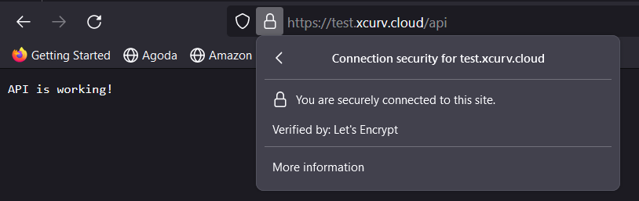

# Installation NGINX

```sh
sudo apt install nginx
```

Check if nginx web server run
```sh
curl localhost
```

or go to browser and access http://localhost

# Create configuration nginx


### 1. Creare configuration file in /etc/nginx/sites-available
/etc/nginx/sites-available/yourdomain.com : [file](./sites-available/yourdomain.com)


### 2. create a symbolic link to it in the /etc/nginx/sites-enabled/ directory.
``` bash
sudo ln -s /etc/nginx/sites-available/yourdomain.com /etc/nginx/sites-enabled/
```

### 3. Test the Nginx configuration for syntax errors:
``` bash
sudo nginx -t
```

### 4. If the test is successful, restart Nginx to apply the changes:
``` bash
sudo service nginx restart
```

### Result


# Setting SSL with Let's Encrypt using Certbot

### 1. Install Certbot and the Nginx Plugin

```sh
sudo apt update
sudo apt install certbot python3-certbot-nginx
```

### 2. Obtain an SSL Certificate

```sh
sudo certbot --nginx -d yourdomain.com
```

### 3. Test the Nginx configuration for syntax errors:
``` bash
sudo nginx -t
```

### 4. If the test is successful, restart Nginx to apply the changes:
``` bash
sudo service nginx restart
```

### 5. Automatic Renewal
Certbot sets up a cron job or systemd timer to automatically renew your certificates before they expire
``` bash
sudo certbot renew --dry-run
```

### Result
